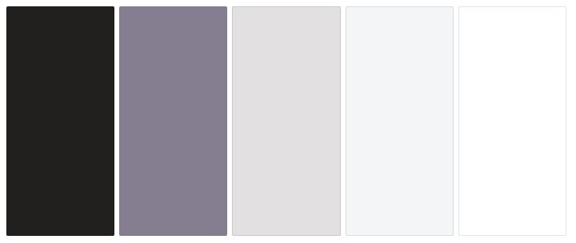
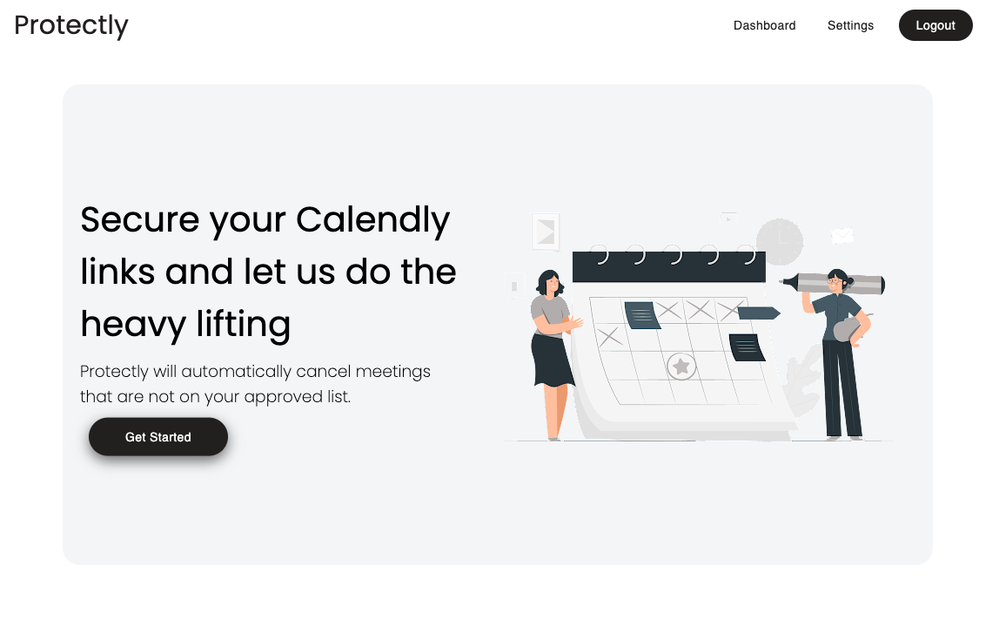
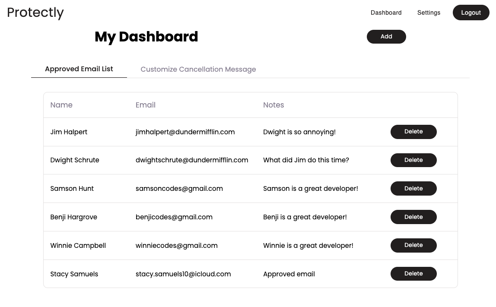
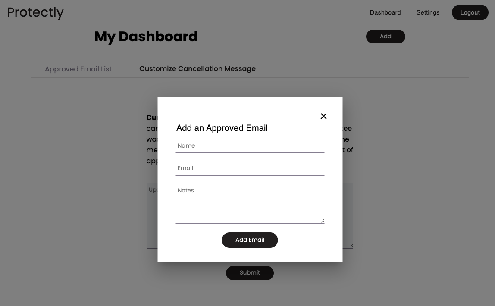
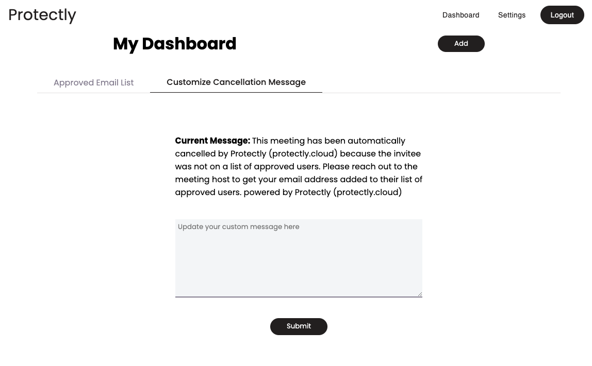

# **_Protectly_**

_Published September 2022_

**_Protectly_** is a full stack web application that allows users to limit their Calendly meetings to only emails on our database. Combining an easy to use modern flow with a robust and reliable back end database, we secure users Calendly links.

**Important Note:** While _Protectly_ is free to use, a paid _Calendly_ Account is required on the Professional Tier to use this service. Please visit Calendly's Pricing Page for more information.

**Presentation:** https://youtu.be/w5yQl5bMSeU

**Blog Post:** https://dev.to/ocampb/capstone-project-275a

## **Created By**

---

### Olivia Campbell

[Email Me](oliviavzcampbell@gmail.com) | [GitHub](https://github.com/ocampb) | [LinkedIn](https://www.linkedin.com/in/campbell2/)

### Amanda Hargrove

[Email Me](amandahargrove98@gmail.com) | [GitHub](https://github.com/hargroa2) | [LinkedIn](https://www.linkedin.com/in/amanda-hargrove-0608/)

### Stacy Samuels

[Email Me](stacy.samuels10@gmail.com) | [GitHub](https://github.com/stacysamuels10) | [LinkedIn](https://www.linkedin.com/in/stacy-samuels/)

---

## **Requirements To Use**

**_Protectly_** is deployed and ready to work for you, so all you need is this [link](protectly.cloud).

If you would like to run the code locally you can use the following steps below.

1. Clone the repository
2. `cp .env.example .env`
3. Update your `.env` file to include your Calendly oauth credentials
4. `npm install`
5. `npm run dev`
6. Visit http://localhost:3000

## How **_Protectly_** Works

---

### Website Overview

**_Protectly_** utilizes a front-end library consisting of React and Redux, styled with CSS, SCSS, and MUI and a backend Node.js/Express/Sequelize server and database.

Users connect their _Calendly_ account to create a webhook that will fire every time a meeting is scheduled using their link. Users will then add as many emails to their _Protectly_ account that are approved to schedule meetings.

Each time a meeting is scheduled _Calendly_ will check our database, if the invitee is not in the Users list, _Calendly_ will automatically cancel the meeting. Users can also customize their cancel message that is tied to the _Calendly_ cancellation email sent to the invitee and them.

---

### Website Features

Here are some of the website's features in greater detail:

- A modern and simple design that utilizes MUI framework.
- Users can add emails along with the name associated with the email as well as notes to remind them of that user.
- Users can delete emails from their list if that email should no longer be allowed
- Users can also customize their message that is sent on their behalf by _Calendly's_ webhook to _Protectly_

---

## Color Palette

The color palette was designed to have a modern black and white feel to it. Being in a corporate setting, we wanted this site to fit into any environment without issue.

Black: #221f1f

Slategray: #857e90

Gray: #e2e0e0

Whitesmoke: #f3f5f7

White: #fff

Hovercolor: #3b3b3b

---

## **_Protectly_** In Development

This website is the final capstone project of our DigitalCrafts Full Stack Boot Camp. **_Protectly_** is intended to demonstrate a clear understanding of using React.js and Redux as front-end libraries, as well as a Node.js backend. This site is ready to use in real world applications and we as a group plan to bring this to users who can benefit from this software.

Our future plans for **_Protectly_**:

- Dark Mode
- Ability to sort the approved list
- Ability to search the approved list
- Set timers on the approved list so they are automatically removed after a set time frame
- Having different lists for different links associated with the user rather than for all links under the account
- Being able to set up team environments similar to _Calendly's_ systems

## Photos of **_Protectly_**

